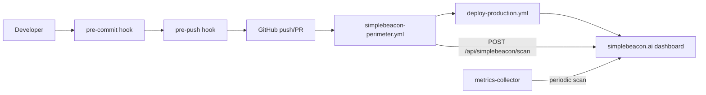

# Simplebeacon DevSecOps / CI/CD Workflow

How Simplebeacon integrates into the software development lifecycle to detect fiction KPIs, credential patterns, production-path leaks, and schema drift **before production** — using the measured tooling already in this repository.

## Overview

```
Developer → git commit/push → Simplebeacon gate → CI perimeter → deploy gate → live dashboard
```

| Layer | Mechanism | Blocks merge? |
|-------|---------|---------------|
| Local pre-commit | Husky → `npm run simplebeacon` | High severity |
| Local pre-push | Husky → `npm run simplebeacon:full` | High + Jest drift |
| PR CI | `simplebeacon-perimeter.yml` | High severity |
| Lightweight PR | `simplebeacon.yml` (composite action) | High severity |
| Main deploy | `deploy-production.yml` | Scan + Jest + SSH deploy |
| Production | Docker metrics collector + webhook | Alerts only |

**Measured baseline:** 596/596 Jest · 42/42 page samples · gate `failOn: ["high"]`

---

## Architecture



---

## Phase 1: Local development

### 1.1 Install git hooks (Husky)

From repository root (`CascadeProjects/`):

```bash
npm install
# husky prepare script registers .husky/pre-commit and .husky/pre-push
```

Or from `ai-platform/` only (without root husky):

```bash
npm run simplebeacon:hook:pre-commit
npm run simplebeacon:hook:pre-push
```

Hooks (`.husky/pre-commit`, `.husky/pre-push` at repo root):

| Hook | Command | Purpose |
|------|---------|---------|
| pre-commit | `cd ai-platform && npm run simplebeacon` | Fast gate (~15–30s) |
| pre-push | `cd ai-platform && npm run simplebeacon:full` | Gate + Jest baseline (slower) |

Skip hooks when needed:

```bash
git commit --no-verify
git push --no-verify
```

### 1.2 Manual local workflow

```bash
cd ai-platform
npm run simplebeacon              # gate, text output
npm run simplebeacon:report         # JSON → .simplebeacon/report.json
npm run simplebeacon:assess         # assessment deliverable
npm test -- --no-coverage           # 596-test baseline
```

### 1.3 Configuration (canonical)

File: `ai-platform/.simplebeacon/config.json` (profile: **cascade**)

```json
{
  "profile": "cascade",
  "scanPaths": ["web/data", "data/mock", "data-central/ai-tools/mock-data"],
  "productionPaths": ["server/"],
  "gate": {
    "failOn": ["high"],
    "warnOn": ["medium", "low"]
  },
  "rules": {
    "credentials": { "enabled": true },
    "json-schema": { "enabled": true },
    "sample-consistency": { "enabled": true },
    "roadmap": { "enabled": true },
    "production-leak": { "enabled": true, "severity": "medium" },
    "jest-baseline": { "enabled": false }
  }
}
```

**Important corrections vs generic templates:**

- Severities are **`high` | `medium` | `low`** only — there is no `critical` severity in the CLI.
- Fiction / narrative detection is **`sample-consistency`** (not a separate `aiFiction` config key).
- `production-leak` scans hardcoded `-sample.json` paths in `server/` and `src/`.

Fiction patterns are seeded from `.simplebeacon/baseline.json` → `rejectedFiction` (62% completion, 47 features, legacy rejected fiction metrics — confidence not instrumented, etc.).

---

## Phase 2: CI/CD pipelines (this repo)

### 2.1 Full perimeter — `/.github/workflows/simplebeacon-perimeter.yml`

Runs on push/PR to `ai-platform/**`:

1. Verify cascade profile + fiction catalog  
2. `npm run simplebeacon:report` (gate)  
3. `npm run simplebeacon:assess`  
4. `npm run trust:publish` (local trust payload + optional remote endpoint push)  
5. Jest suite  
6. PR comment via `npm run simplebeacon:comment`  
7. Optional webhook → `POST $SIMPLEBEACON_DASHBOARD_URL/api/simplebeacon/scan`  
8. Upload `.simplebeacon/report.json` + `assessment.json` artifacts  

### 2.2 Lightweight gate — `/.github/workflows/simplebeacon.yml`

Uses composite action `ai-platform/action` with `post-comment: true` on JSON/JS path filters, then runs `npm run trust:publish` in non-blocking mode for trust badge artifact freshness.

### 2.3 Dashboard CI — `/.github/workflows/dashboard-ci.yml`

Jest + Istanbul coverage + Docker Compose config smoke.

### 2.4 Production deploy — `/.github/workflows/deploy-production.yml`

1. Compliance gate (scan + assess + Jest)  
2. SSH deploy → `ai-platform/scripts/deploy-simplebeacon.sh`  
3. Verify `GET /api/simplebeacon/audit` on public URL (if secret set)  

**GitHub secrets:**

| Secret | Purpose |
|--------|---------|
| `GITHUB_TOKEN` | PR comments (automatic) |
| `SIMPLEBEACON_DASHBOARD_URL` | e.g. `https://simplebeacon.ai` |
| `SIMPLEBEACON_DASHBOARD_TOKEN` | Optional Bearer for scan webhook |
| `SIMPLEBEACON_TRUST_PUBLISH_URL` | Optional trust publish endpoint for badge payload |
| `SIMPLEBEACON_TRUST_PUBLISH_TOKEN` | Optional Bearer token for trust publish endpoint |
| `SERVER_HOST`, `SERVER_USER`, `SSH_PRIVATE_KEY` | Production deploy |

### 2.5 GitLab CI (external repos)

```yaml
simplebeacon-scan:
  stage: test
  image: node:20
  script:
    - cd ai-platform && npm ci
    - npm run simplebeacon:report
    - npm run simplebeacon:assess -- --output .simplebeacon/assessment.json
  artifacts:
    paths: [ai-platform/.simplebeacon/report.json]
    when: always
  rules:
    - if: $CI_PIPELINE_SOURCE == "merge_request_event"
```

### 2.6 Jenkins (external repos)

```groovy
stage('Simplebeacon') {
  steps {
    dir('ai-platform') {
      sh 'npm ci'
      sh 'npm run simplebeacon:report'
    }
  }
  post {
    always {
      archiveArtifacts artifacts: 'ai-platform/.simplebeacon/report.json'
    }
  }
}
```

---

## Phase 3: Pull request integration

### 3.1 Automated PR comments

Built into the CLI (`packages/simplebeacon-cli/src/reporters/github-comment.js`):

```bash
cd ai-platform
npm run simplebeacon:comment
```

Environment:

```bash
export GITHUB_TOKEN=...
export GITHUB_REPOSITORY=owner/repo
export GITHUB_EVENT_PULL_REQUEST_NUMBER=42
```

Example comment sections: gate pass/fail, severity table, blocking issues, scan paths.

### 3.2 Merge blocking

Configure **branch protection** on `main`:

- Require `SampleBeacon Security & Compliance Perimeter` (or `Simplebeacon`) check  
- Require `Dashboard CI` / `Deploy Production` compliance job as needed  

Gate behavior:

| Severity | Default |
|----------|---------|
| high | **Blocks** (`gate.failOn`) |
| medium, low | Warn in comment / job summary |

There is no separate `prRules` JSON block — use `gate.failOn` in config + branch protection.

---

## Phase 4: Dashboard integration

### 4.1 Live API (implemented)

| Endpoint | Purpose |
|----------|---------|
| `GET /api/simplebeacon/dashboard` | Aggregate scan status + trends |
| `GET /api/simplebeacon/audit` | All audit layers + fiction catalog |
| `GET /api/simplebeacon/assessment` | Assessment report |
| `POST /api/simplebeacon/scan` | Trigger scan + update history |
| `POST /api/simplebeacon/npm-audit` | Live dependency audit |
| `/api/ai-validation/*` | Aliases for the above |

UI: `https://simplebeacon.ai/#/audit` (Compliance Audit view)

### 4.2 CI → dashboard sync

Perimeter workflow (already wired):

```bash
curl -X POST "$SIMPLEBEACON_DASHBOARD_URL/api/simplebeacon/scan" \
  -H "Content-Type: application/json" \
  -d '{}'
```

Docker **metrics-collector** profile repeats this on an interval (default 600s):

```bash
npm run simplebeacon:docker:full
```

### 4.3 Slack / email alerts (planned)

Not yet implemented in code. Recommended pattern:

1. GitHub Actions `if: failure()` step → Slack incoming webhook  
2. Or dashboard sidecar watching `.simplebeacon/report.json` for `severityCounts.high > 0`  

---

## Phase 5: Deployment gates

### 5.1 Pre-deploy checklist

`deploy-production.yml` enforces:

```bash
npm run simplebeacon:report   # exit 1 on high issues
npm run simplebeacon:assess
npm test -- --no-coverage
```

### 5.2 Production monitoring

```bash
# Docker collector (recommended)
npm run simplebeacon:docker:full

# Manual cron alternative
*/15 * * * * curl -fsS -X POST http://127.0.0.1:54355/api/simplebeacon/scan \
  -H "Content-Type: application/json" -d '{}'
```

---

## Phase 6: Incident response

### 6.1 Critical/high detection

When gate fails:

1. Read `.simplebeacon/report.json` → `rawIssues`  
2. Categories: `Fictional KPI`, `Credential Pattern`, `Production Leak`, `Schema Violation`  
3. Fix → re-run `npm run simplebeacon:report` locally  
4. Push fix → CI confirms clean scan  

### 6.2 Remediation loop

```
Identify → Fix sample/code → simplebeacon:report (pass) → commit → PR comment green → deploy
```

---

## Phase 7: Continuous improvement

### 7.1 Baseline sync

After Jest count changes:

```bash
cd ai-platform
npm test
npm run simplebeacon:baseline-sync
git add .simplebeacon/baseline.json
```

### 7.2 Allowlists

Production leak allowlist (real paths in config):

```json
"production-leak": {
  "allowlistFiles": [
    "server/lib/sample-path-resolver.js",
    "server/lib/code-roadmap-generator.js"
  ]
}
```

Credential / fiction tuning: update `.simplebeacon/baseline.json` → `rejectedFiction`, then sync samples with `node tools/sync-audit-baseline-samples.js`.

---

## Audit layers reference

| Layer | Rule | API field |
|-------|------|-----------|
| Credentials | `credentials` | `auditLayers.credentials` |
| Fiction KPIs | `sample-consistency` | `auditLayers.fictionKpis` |
| JSON schema | `json-schema` | `auditLayers.schema` |
| Production leaks | `production-leak` | `auditLayers.productionLeaks` |
| Roadmap / dupes | `roadmap` | `auditLayers.roadmap` |
| Jest baseline | `jest-baseline` | `auditLayers.jestBaseline` |
| Gate | `evaluateGate` | `auditLayers.gate` |

---

## Monitoring KPIs

Track from `.simplebeacon/history.json` and dashboard:

- Gate pass rate  
- `issueCount` trend  
- `qualityScore` / `consistencyScore`  
- Scan duration (CLI verbose / CI job time)  
- Deployment blocks (GitHub Actions failure count)  

---

## Troubleshooting

| Issue | Fix |
|-------|-----|
| Hook not running | `npm install` at repo root; ensure Git uses `.husky/` |
| `critical` in fail-on ignored | Use `high` only — no critical severity |
| Dashboard empty | `curl -X POST localhost:54355/api/simplebeacon/scan -d '{}'` |
| Fiction false positive on catalog sample | `fictional-patterns-report` type is exempt |
| CI webhook skipped | Set `SIMPLEBEACON_DASHBOARD_URL` secret |

---

## Rollout strategy

| Week | Action |
|------|--------|
| 1 | Enable hooks locally; perimeter on PRs (warn only → tune allowlists) |
| 2 | Branch protection requires perimeter check; block on high |
| 3 | Set dashboard URL secret; enable deploy-production on main |
| 4+ | Optional Slack; monthly baseline sync; review fiction catalog |

---

## Related docs

- [SIMPLEBEACON_DEPLOYMENT_ROADMAP.md](./SIMPLEBEACON_DEPLOYMENT_ROADMAP.md)
- [docs/compliance-monitoring-runbook.md](./docs/compliance-monitoring-runbook.md)
- [packages/simplebeacon-cli/docs/CI.md](./packages/simplebeacon-cli/docs/CI.md)
- [packages/simplebeacon-cli/docs/GITHUB-ACTION-QUICKSTART.md](./packages/simplebeacon-cli/docs/GITHUB-ACTION-QUICKSTART.md)
- [packages/simplebeacon-cli/docs/DOCKER.md](./packages/simplebeacon-cli/docs/DOCKER.md)

---

*Last updated: 2026-05-24 · Version 1.0 · Aligned to measured repo (596/596, 42/42, cascade profile)*
