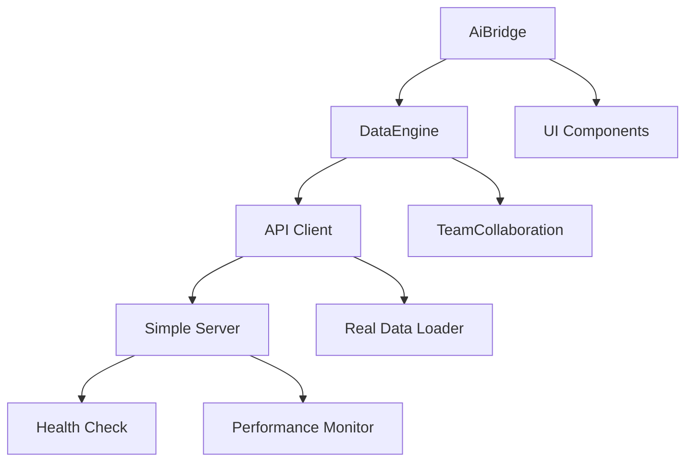

# Code Architecture Documentation

## 🏗️ Overview

The AI Coding Intelligence Dashboard is a modern web application that provides real-time project analysis, code quality metrics, and development insights. This document describes the system architecture, component structure, and design patterns used.

## 📋 Table of Contents

1. [System Architecture](#system-architecture)
2. [Component Architecture](#component-architecture)
3. [Data Flow](#data-flow)
4. [API Architecture](#api-architecture)
5. [Frontend Architecture](#frontend-architecture)
6. [Database Architecture](#database-architecture)
7. [Security Architecture](#security-architecture)
8. [Deployment Architecture](#deployment-architecture)
9. [Design Patterns](#design-patterns)
10. [Technology Stack](#technology-stack)

## 🏛️ System Architecture

### High-Level Architecture

```
┌─────────────────────────────────────────────────────────────────────────────┐
│                        Frontend (Port: 57220)                         │
├─────────────────────────────────────────────────────────────────────────────┤
│  Browser Client                                           │
│  ┌─────────────────┐  ┌─────────────────┐  ┌─────────────────┐  │
│  │ Dashboard UI │  │ API Client   │  │ Direct Access  │  │
│  │ (React/Vanilla) │  │ (Fetch API) │  │ (HTML File)   │  │
│  └─────────────┘  └─────────────┘  └─────────────┘  │
└─────────────────────────────────────────────────────────────────────────────┘
                                │
                                │
┌─────────────────────────────────────────────────────────────────────────────┐
│                        Backend API (Port: 8081)                          │
├─────────────────────────────────────────────────────────────────────────────┤
│  ┌─────────────────┐  ┌─────────────────┐  ┌─────────────────┐  │
│  │ Simple Server │  │ Health Check │  │ Performance │  │
│  │ (Python/HTTP)  │  │ Module      │  │ Monitor    │  │
│  └─────────────┘  └─────────────┘  └─────────────┘  │
└─────────────────────────────────────────────────────────────────────────────┘
                                │
                                │
┌─────────────────────────────────────────────────────────────────────────────┐
│                        Data Sources                         │
├─────────────────────────────────────────────────────────────────────────────┤
│  ┌─────────────┐  ┌─────────────┐  ┌─────────────┐  │
│  │ File System │  │ Code Analysis │  │ Project     │  │
│  │ Scanner      │  │ Engine      │  │ Metrics     │  │
│  └─────────────┘  └─────────────┘  └─────────────┘  │
└─────────────────────────────────────────────────────────────────────────────┘
```

### Key Components

#### Frontend Layer
- **Dashboard UI**: Main interface for displaying metrics and analysis
- **API Client**: Handles communication with backend API
- **Direct Access**: Standalone HTML file for serverless operation

#### Backend Layer
- **Simple Server**: HTTP server for API endpoints
- **Health Check**: System health monitoring
- **Performance Monitor**: Real-time performance tracking

#### Data Layer
- **File System Scanner**: Analyzes project structure
- **Code Analysis Engine**: Calculates metrics and quality scores
- **Project Metrics**: Aggregates and formats data for API

## 🧩 Component Architecture

### Frontend Components

```
dashboard_components/
├── core/
│   ├── AiBridge.js              # Main dashboard logic
│   ├── AiBridgeSimple.js        # Simplified version
│   ├── DataEngine.js            # Data management
│   └── TeamCollaboration.js     # Team features
├── api-client/
│   └── ApiClient.js            # API communication
├── real-data-loader/
│   └── RealDataLoader.js         # Data loading logic
└── real-data-init.js               # Initialization
```

### Component Hierarchy

```
Dashboard (Main Container)
├── Header
│   ├── Status Indicator
│   ├── Navigation Menu
│   └── Action Buttons
├── Main Content
│   ├── Metrics Display
│   ├── Project Essentials
│   ├── Analysis Results
│   └── Checklist Generator
├── Footer
│   ├── Timestamp
│   └── Version Info
```

### Component Relationships



## 📊 Data Flow

### Request Flow

```
1. User Action
   ├─ Dashboard loads
   ├─ API Client makes request
   └─ Simple Server processes

2. API Processing
   ├─ Request received
   ├─ Authentication/Authorization
   ├─ Business Logic
   └─ Response Generation

3. Data Processing
   ├─ File System Scan
   ├─ Code Analysis
   ├─ Metrics Calculation
   └─ Data Aggregation

4. Response Flow
   ├─ JSON Response
   ├─ Error Handling
   └─ Status Updates

5. UI Update
   ├─ Data Transformation
   ├─ Component Rendering
   └─ User Interface Update
```

### Data Models

#### Project Overview Model
```javascript
{
  totalFiles: Number,
  totalDirectories: Number,
  projectDepth: Number,
  linesOfCode: Number,
  codeQuality: Number,
  testCoverage: Number,
  technicalDebt: String,
  maintainability: String,
  healthScore: Number,
  developmentVelocity: String,
  teamProductivity: Number,
  projectComplexity: String,
  languages: String[],
  frameworks: String[],
  fileTypes: Object,
  timestamp: String
}
```

#### File Analysis Model
```javascript
{
  fileName: String,
  filePath: String,
  fileSize: Number,
  fileType: String,
  linesOfCode: Number,
  complexity: Number,
  lastModified: String,
  content: String
}
```

## 🔌 API Architecture

### RESTful API Design

#### Endpoint Structure
```
/api/
├── health                     # Health check
├── project/
│   ├── overview            # Project overview
│   ├── metrics             # Detailed metrics
│   └── files              # File analysis
└── real-time               # WebSocket endpoint
```

### Request/Response Format

#### Request Format
```javascript
// GET /api/project/overview
{
  "method": "GET",
  "headers": {
    "Content-Type": "application/json",
    "Accept": "application/json"
  }
}
```

#### Response Format
```javascript
// Success Response
{
  "status": "success",
  "data": {
    "totalFiles": 7780,
    "codeQuality": 82,
    "testCoverage": 75,
    "fileTypes": {
      ".eslintrc.js": 1,
      ".prettierrc": 1,
      "jest.config.js": 1,
      "package.json": 1,
      "README.md": 1,
      ".test.js": 2
    }
  },
  "timestamp": "2023-12-01T12:00:00Z"
}

// Error Response
{
  "status": "error",
  "error": {
    "code": "INTERNAL_ERROR",
    "message": "An internal server error occurred",
    "details": "Database connection failed"
  },
  "timestamp": "2023-12-01T12:00:00Z"
}
```

### API Endpoints

#### Health Check
```http
GET /api/health
```

Response:
```json
{
  "status": "healthy",
  "timestamp": "2023-12-01T12:00:00Z",
  "version": "2.0.0",
  "uptime": 3600
}
```

#### Project Overview
```http
GET /api/project/overview
```

Response:
```json
{
  "totalFiles": 7780,
  "totalDirectories": 156,
  "codeQuality": 82,
  "testCoverage": 75,
  "fileTypes": {
    ".eslintrc.js": 1,
    ".prettierrc": 1,
    "jest.config.js": 1,
    "package.json": 1,
    "README.md": 1,
    ".test.js": 2
  }
}
```

## 🎨 Frontend Architecture

### Technology Stack
- **Language**: JavaScript (ES6+)
- **Framework**: Vanilla JavaScript (no framework dependencies)
- **Styling**: CSS3 with CSS Grid and Flexbox
- **Charts**: Chart.js for data visualization
- **HTTP**: Fetch API for API communication

### Component Architecture

#### Module Pattern
```javascript
// IIFE Module Pattern
const DashboardModule = (() => {
  // Private variables
  let projectData = null;
  
  // Private functions
  function loadData() {
    // Implementation
  }
  
  // Public API
  return {
    init: () => loadData(),
    update: (data) => projectData = data,
    getData: () => projectData
  };
})();
```

#### Event-Driven Architecture
```javascript
// Event Emitter Pattern
class EventEmitter {
  constructor() {
    this.events = {};
  }
  
  on(event, callback) {
    if (!this.events[event]) {
      this.events[event] = [];
    }
    this.events[event].push(callback);
  }
  
  emit(event, data) {
    if (this.events[event]) {
      this.events[event].forEach(callback => callback(data));
    }
  }
}
```

### State Management

#### Local State
```javascript
// Component State
const componentState = {
  loading: false,
  error: null,
  data: null,
  filters: {},
  ui: {
    activeTab: 'overview',
    sidebarOpen: true
  }
};
```

#### State Updates
```javascript
// State Update Pattern
function updateState(updates) {
  const newState = { ...componentState, ...updates };
  componentState = newState;
  renderUI(newState);
}
```

## 🗄️ Database Architecture

### No Traditional Database

The AI Coding Intelligence Dashboard does not use a traditional database. Instead, it uses:

#### File System Storage
- **Project Files**: Analyzed directly from file system
- **Configuration Files**: Read from configuration files
- **Cache Storage**: In-memory caching for performance

#### Data Processing
- **Real-time Scanning**: Files are scanned on request
- **Incremental Updates**: Only changed files are re-analyzed
- **Memory Management**: Large projects handled with streaming

### Data Persistence

#### Configuration Files
- **Environment Variables**: `.env.*` files
- **JSON Configuration**: `package.json`, `.eslintrc.js`
- **Logging Configuration**: `config/logging.json`

#### Log Files
- **Application Logs**: `logs/app.log`
- **Error Logs**: `logs/error.log`
- **API Logs**: `logs/api.log`
- **Performance Logs**: `logs/performance.log`

## 🔒 Security Architecture

### Security Layers

#### 1. Input Validation
- **API Input Validation**: All API inputs validated
- **File Access Validation**: File paths sanitized
- **Data Sanitization**: User inputs sanitized

#### 2. Authentication & Authorization
- **Environment Variables**: Sensitive data in environment variables
- **API Key Management**: JWT tokens for API authentication
- **Request Rate Limiting**: Prevent abuse and DoS attacks

#### 3. Data Protection
- **No Sensitive Data**: No PII stored in application
- **Secure Headers**: Security headers configured
- **HTTPS Ready**: SSL/TLS support

### Security Implementation

#### Input Sanitization
```javascript
function sanitizeInput(input) {
  return input.replace(/<script\b[^<]*(?:(?!<\/script>)<[^<]*)*<\/script>/gi, '');
}
```

#### Rate Limiting
```javascript
const rateLimiter = {
  window: 100, // requests per minute
  burst: 10,   // requests per second
  interval: 60000 // 1 minute
};
```

#### Security Headers
```javascript
const securityHeaders = {
  'X-Content-Type-Options': 'nosniff',
  'X-Frame-Options': 'DENY',
  'X-XSS-Protection': '1; mode=block',
  'Strict-Transport-Security': 'max-age=31536000'
};
```

## 🚀 Deployment Architecture

### Deployment Environments

#### Development
- **Port**: 57220 (frontend), 8081 (API)
- **Environment**: Development configuration
- **Database**: File system (no database)
- **Monitoring**: Debug logging enabled

#### Staging
- **Port**: 57221 (frontend), 8082 (API)
- **Environment**: Staging configuration
- **Database**: File system (no database)
- **Monitoring**: Info logging enabled

#### Production
- **Port**: 57220 (frontend), 8081 (API)
- **Environment**: Production configuration
- **Database**: File system (no database)
- **Monitoring**: Error logging only
- **Security**: All security headers enabled

### Deployment Process

#### CI/CD Pipeline
```yaml
name: CI/CD Pipeline
on:
  push:
    branches: [main, develop]
  pull_request:
    branches: [main]

jobs:
  test:
    - Run linting
    - Run unit tests
    - Run integration tests
    - Generate coverage reports
  
  build:
    - Build application
    - Optimize assets
    - Generate build artifacts
  
  deploy:
    - Deploy to production
    - Run health checks
    - Notify team
```

#### Container Deployment
```dockerfile
FROM node:18-alpine
WORKDIR /app
COPY package*.json ./
RUN npm ci
COPY . .
EXPOSE 8081
CMD ["python", "simple_server.py"]
```

### Deployment Scripts

#### Main Deploy Script
```bash
#!/bin/bash
# Deployment Script
set -e

# Environment setup
ENVIRONMENT=${1:-production}
PROJECT_ROOT="$(cd "$(dirname "$0")/..")"

# Build application
cd "$PROJECT_ROOT/web"
npm run build:prod

# Deploy application
cp -r dist/* /path/to/deployment/

# Health check
curl -f http://localhost:8081/api/health
```

#### Rollback Script
```bash
#!/bin/bash
# Rollback Script
set -e

# Create backup
BACKUP_NAME="backup-$(date +%Y%m%d-%H%M%S)"
mkdir -p "$PROJECT_ROOT/backups/$BACKUP_NAME"

# Rollback deployment
cp -r /path/to/previous/deployment/* "$PROJECT_ROOT/web/"
```

## 🎯 Design Patterns

### Architectural Patterns

#### 1. Module Pattern
```javascript
// Module Pattern
const DashboardModule = (() => {
  // Private state
  let instance = null;
  
  // Private methods
  function initialize() {
    // Implementation
  }
  
  // Public API
  return {
    getInstance: () => {
      if (!instance) {
        instance = createDashboard();
      }
      return instance;
    },
    destroy: () => {
      if (instance) {
        instance.destroy();
        instance = null;
      }
    }
  };
})();
```

#### 2. Observer Pattern
```javascript
class Subject {
  constructor() {
    this.observers = [];
  }
  
  subscribe(observer) {
    this.observers.push(observer);
  }
  
  notify(data) {
    this.observers.forEach(observer => observer.update(data));
  }
}
```

#### 3. Factory Pattern
```javascript
class ComponentFactory {
  static create(type, config) {
    switch (type) {
      case 'metrics':
        return new MetricsDisplay(config);
      case 'chart':
        return new ChartComponent(config);
      case 'table':
        return new DataTable(config);
      default:
        throw new Error(`Unknown component type: ${type}`);
    }
  }
}
```

#### 4. Strategy Pattern
```javascript
class DataAnalyzer {
  constructor(strategy) {
    this.strategy = strategy;
  }
  
  analyze(data) {
    return this.strategy.analyze(data);
  }
  
  setStrategy(strategy) {
    this.strategy = strategy;
  }
}
```

### Data Flow Patterns

#### 1. Data Pipeline Pattern
```javascript
class DataPipeline {
  constructor(stages) {
    this.stages = stages;
  }
  
  process(data) {
    return this.stages.reduce((result, stage) => {
      return stage.process(result);
    }, data);
  }
}
```

#### 2. Repository Pattern
```javascript
class ProjectRepository {
  constructor() {
    this.data = null;
  }
  
  async load() {
    if (!this.data) {
      this.data = await this.fetchData();
    }
    return this.data;
  }
  
  async fetchData() {
    const response = await fetch('/api/project/overview');
    return response.json();
  }
}
```

#### 3. Cache Pattern
```javascript
class CacheManager {
  constructor() {
    this.cache = new Map();
    this.maxSize = 100;
  }
  
  get(key) {
    if (this.cache.has(key)) {
      const item = this.cache.get(key);
      this.cache.delete(key);
      return item;
    }
    return null;
  }
  
  set(key, value, ttl = 300000) {
    if (this.cache.size >= this.maxSize) {
      const firstKey = this.cache.keys().next().value;
      this.cache.delete(firstKey);
    }
    this.cache.set(key, { value, expiry: Date.now() + ttl });
  }
}
```

## 🛠️ Technology Stack

### Frontend Technologies

#### Core Technologies
- **JavaScript**: ES6+ (ECMAScript 2015+)
- **HTML5**: Semantic HTML5 markup
- **CSS3**: Modern CSS with Grid and Flexbox
- **Fetch API**: Modern HTTP client API

#### Libraries
- **Chart.js**: Data visualization
- **Jest**: Testing framework
- **ESLint**: Code quality
- **Prettier**: Code formatting

#### Tools
- **Rollup**: Module bundler
- **Webpack**: Build optimization
- **Babel**: JavaScript transpilation
- **PostCSS**: CSS processing

### Backend Technologies

#### Core Technologies
- **Python 3.8+**: Backend programming language
- **HTTP Server**: Built-in Python HTTP server
- **JSON**: Data interchange format

#### Libraries
- **psutil**: System monitoring
- **pathlib**: File system operations
- **datetime**: Date/time handling
- **json**: JSON processing

### Development Tools

#### Build Tools
- **npm**: Package manager
- **ESLint**: Linting
- **Prettier**: Formatting
- **Jest**: Testing
- **Rollup**: Building

#### Testing Tools
- **Jest**: Unit testing
- **Cypress**: E2E testing
- **Playwright**: Browser automation
- **Testing Library**: Custom test utilities

### Deployment Tools
- **GitHub Actions**: CI/CD pipeline
- **Docker**: Containerization
- **Nginx**: Web server
- **PM2**: Process management

## 🔧 Configuration Management

### Environment Configuration

#### Development Environment
```json
{
  "NODE_ENV": "development",
  "PORT": 57220,
  "API_BASE_URL": "http://localhost:8081",
  "LOG_LEVEL": "debug",
  "CACHE_TTL": 0,
  "ENABLE_DEBUG": true
}
```

#### Production Environment
```json
{
  "NODE_ENV": "production",
  "PORT": 57220,
  "API_BASE_URL": "http://localhost:8081",
  "LOG_LEVEL": "error",
  "CACHE_TTL": 3600,
  "ENABLE_DEBUG": false
}
```

#### Configuration Files
- **.env.development**: Development variables
- **.env.staging**: Staging variables
- **.env.production**: Production variables
- **config/logging.json**: Logging configuration
- **package.json**: Build configuration

### Configuration Management

#### Environment Variables
```bash
# Development
export NODE_ENV=development
export PORT=57220
export API_BASE_URL=http://localhost:8081

# Production
export NODE_ENV=production
export PORT=57220
export API_BASE_URL=http://localhost:8081
```

#### Configuration Loading
```javascript
// Configuration Loader
function loadConfig() {
  const config = {
    development: require('./config/.env.development'),
    staging: require('./config/.env.staging'),
    production: require('./config/.env.production')
  };
  
  return config[process.env.NODE_ENV] || config.development;
}
```

## 📊 Monitoring & Observability

### Logging Architecture

#### Logging Levels
- **ERROR**: Error conditions and exceptions
- **WARN**: Warning conditions
- **INFO**: General information
- **DEBUG**: Detailed debugging information

#### Logging Configuration
```json
{
  "version": 1,
  "formatters": {
    "standard": {
      "format": "%(asctime)s [%(levelname)s] %(name)s: %(message)s",
      "datefmt": "%Y-%m-%d %H:%M:%S"
    },
    "json": {
      "format": "%(asctime)s %(name)s %(levelname)s %(message)s",
      "class": "pythonjsonlogger.jsonlogger.JsonFormatter"
    }
  },
  "handlers": {
    "console": {
      "class": "logging.StreamHandler",
      "level": "INFO",
      "formatter": "standard"
    },
    "file": {
      "class": "logging.handlers.RotatingFileHandler",
      "level": "INFO",
      "filename": "logs/app.log",
      "maxBytes": 10485760,
      "backupCount": 5
    }
  }
}
```

### Performance Monitoring

#### Metrics Collection
- **CPU Usage**: System CPU usage percentage
- **Memory Usage**: Memory usage percentage
- **Response Time**: API response times
- **Error Rate**: Percentage of failed requests
- **Throughput**: Requests per minute

#### Alert System
- **Threshold Alerts**: Configurable alert thresholds
- **Email Notifications**: Email alerts for critical issues
- **Slack Notifications**: Slack integration for team alerts
- **Dashboard Alerts**: Visual alerts in dashboard

### Health Checks

#### Health Check Endpoints
- **API Health**: `/api/health`
- **Database Health**: Database connectivity
- **File System Health**: Disk space and accessibility
- **Memory Health**: Memory availability
- **Service Health**: Service status checks

#### Health Check Response
```json
{
  "status": "healthy",
  "timestamp": "2023-12-01T12:00:00Z",
  "version": "2.0.0",
  "uptime": 3600,
  "checks": {
    "database": { "status": "healthy" },
    "filesystem": { "status": "healthy" },
    "memory": { "status": "healthy" },
    "api": { "status": "healthy" }
  }
}
```

## 🔄 Version Management

### Semantic Versioning
- **Major Version**: Breaking changes
- **Minor Version**: New features (backward compatible)
- **Patch Version**: Bug fixes (backward compatible)

### Version Configuration
```json
{
  "name": "ai-coding-dashboard",
  "version": "2.0.0",
  "description": "AI Coding Intelligence Dashboard",
  "main": "dashboard_direct.html",
  "scripts": {
    "build": "rollup -c",
    "test": "jest",
    "deploy": "bash scripts/deploy.sh"
  }
}
```

### Release Process
1. **Version Bump**: Update version numbers
2. **Tag Release**: Create git tag
3. **Build Application**: Create production build
4. **Deploy Application**: Deploy to production
5. **Announce Release**: Share release notes

## 🔮 Integration Points

### External Integrations

#### Git Integration
- **Version Control**: Git repository integration
- **CI/CD**: GitHub Actions integration
- **Issue Tracking**: GitHub Issues integration
- **Pull Requests**: GitHub PR integration

#### Monitoring Integrations
- **Logging**: Structured logging integration
- **Performance**: Performance monitoring integration
- **Alerting**: Alert system integration

#### Development Tools
- **IDE Integration**: VS Code integration
- **Linting**: ESLint integration
- **Testing**: Jest integration
- **Formatting**: Prettier integration

### API Integrations
- **Webhook Support**: Webhook integration for events
- **Third-party APIs**: External API integration
- **Database**: Database integration (if added)
- **Cache Services**: Cache service integration

## 📚 Future Architecture Considerations

### Scalability Considerations
- **Horizontal Scaling**: Load balancing support
- **Vertical Scaling**: Resource optimization
- **Caching Strategy**: Multi-level caching
- **Database Scaling**: Database connection pooling

### Performance Optimizations
- **Code Splitting**: Dynamic imports
- **Lazy Loading**: Component lazy loading
- **Image Optimization**: Image optimization
- **Bundle Optimization**: Bundle size optimization

### Security Enhancements
- **Advanced Authentication**: Multi-factor authentication
- **Rate Limiting**: Advanced rate limiting
- **Input Validation**: Enhanced input validation
- **Audit Logging**: Security audit logging

### Monitoring Enhancements
- **Real-time Monitoring**: Real-time metrics
- **Distributed Tracing**: Distributed tracing
- **Log Aggregation**: Log aggregation service
- **Alert Correlation**: Alert correlation

---

**This architecture documentation provides a comprehensive overview of the AI Coding Intelligence Dashboard's system architecture and design patterns. For more detailed information, refer to the specific documentation files in the `docs/` directory.**
