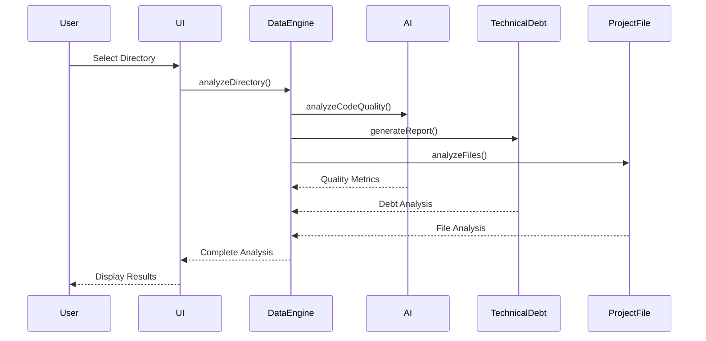

# Code Documentation

**Generated:** 2026-05-17  
**Version:** 1.0.0  
**Project:** AI Coding Intelligence Dashboard

## Overview

This document provides comprehensive code documentation for the AI Coding Intelligence Dashboard, including component architecture, data flow, and implementation details.

## Table of Contents

- [Architecture Overview](#architecture-overview)
- [Core Components](#core-components)
- [Data Flow](#data-flow)
- [Component Interactions](#component-interactions)
- [Configuration](#configuration)
- [Development Guidelines](#development-guidelines)

---

## Architecture Overview

### System Architecture

```
┌─────────────────────────────────────────────────────────────┐
│                    AI Coding Dashboard                        │
├─────────────────────────────────────────────────────────────┤
│  Frontend Layer                                               │
│  ├── index.html (Main Application)                           │
│  ├── dashboard_components/ (UI Components)                   │
│  └── css/ (Styling)                                          │
├─────────────────────────────────────────────────────────────┤
│  Business Logic Layer                                        │
│  ├── DataEngine.js (Data Processing)                         │
│  ├── AiBridge.js (AI Integration)                           │
│  ├── TechnicalDebtAnalyzer.js (Analysis)                     │
│  └── ProjectFileAnalyzer.js (File Analysis)                  │
├─────────────────────────────────────────────────────────────┤
│  API Layer                                                   │
│  ├── api/ (Backend Services)                                 │
│  ├── health.js (Health Monitoring)                          │
│  └── deploy.sh (Deployment Scripts)                         │
└─────────────────────────────────────────────────────────────┘
```

### Key Design Principles

1. **Modular Architecture:** Each component has a single responsibility
2. **Data-Driven UI:** UI updates based on data state changes
3. **Error Resilience:** Comprehensive error handling and recovery
4. **Performance Optimization:** Lazy loading and caching strategies
5. **Extensibility:** Plugin-like architecture for easy feature addition

---

## Core Components

### 1. Main Application (`index.html`)

**Purpose:** Main application entry point and UI container

**Key Responsibilities:**
- Initialize dashboard components
- Manage application state
- Handle user interactions
- Coordinate component communication

**Initialization Flow:**
```javascript
// Application initialization sequence
1. Load core dependencies (Chart.js, D3.js)
2. Initialize dashboard components
3. Set up event listeners
4. Load initial data
5. Render UI components
```

**Global State Management:**
```javascript
window.projectDataStore = {
  currentAddress: './',
  analyses: {},
  lastAnalysis: null,
  history: [],
  favorites: []
};
```

### 2. Data Engine (`dashboard_components/core/DataEngine.js`)

**Purpose:** Central data processing and caching engine

**Key Features:**
- Data caching and invalidation
- Background data loading
- Data transformation and normalization
- Error handling and retry logic

**Core Methods:**
```javascript
class DataEngine {
  // Set current working directory
  setCurrentDirectory(path)
  
  // Analyze directory structure
  analyzeDirectory(path, options)
  
  // Get cached analysis
  getCachedAnalysis(path)
  
  // Clear cache
  clearCache()
  
  // Get analysis history
  getHistory(limit, offset)
}
```

**Data Flow:**
```
User Request → DataEngine → Cache Check → API Call → Data Processing → Cache Store → UI Update
```

### 3. AI Bridge (`dashboard_components/core/AiBridge.js`)

**Purpose:** AI integration and intelligent analysis

**Capabilities:**
- Code quality analysis
- Technical debt assessment
- Recommendation generation
- Pattern recognition

**Analysis Pipeline:**
```javascript
class AiBridge {
  // Analyze code quality
  analyzeCodeQuality(code, options)
  
  // Generate technical debt report
  generateTechnicalDebtReport(projectData)
  
  // Create actionable recommendations
  generateRecommendations(analysis)
  
  // Detect code patterns
  detectPatterns(codebase)
}
```

**AI Analysis Flow:**
```
Project Data → Feature Extraction → AI Model → Analysis Results → Recommendations
```

### 4. Technical Debt Analyzer (`dashboard_components/core/TechnicalDebtAnalyzer.js`)

**Purpose:** Comprehensive technical debt analysis

**Analysis Categories:**
- Code Complexity
- Code Duplication
- Code Smells
- Test Coverage
- Documentation
- Dependencies
- Security
- Performance

**Scoring Algorithm:**
```javascript
calculateTechnicalDebtScore(metrics) {
  const weights = {
    codeComplexity: 0.25,
    codeDuplication: 0.15,
    codeSmells: 0.20,
    testCoverage: 0.20,
    documentation: 0.10,
    dependencies: 0.05,
    security: 0.03,
    performance: 0.02
  };
  
  return Object.entries(metrics).reduce((score, [metric, value]) => {
    return score + (value * weights[metric]);
  }, 0);
}
```

### 5. Project File Analyzer (`dashboard_components/core/ProjectFileAnalyzer.js`)

**Purpose:** Project structure and configuration analysis

**Analysis Features:**
- Configuration file detection
- Untracked file identification
- Project structure validation
- Best practices compliance

**Configuration File Check:**
```javascript
checkMissingConfigFiles(directoryPath, projectData) {
  const essentialConfigs = [
    '.gitignore', '.env.example', 'package.json', 
    'README.md', '.eslintrc.js', '.prettierrc'
  ];
  
  return essentialConfigs.filter(config => 
    !this.fileExists(config, projectData)
  );
}
```

---

## Data Flow

### Analysis Data Flow

```
┌─────────────┐    ┌─────────────┐    ┌─────────────┐    ┌─────────────┐
│ User Input  │───▶│ DataEngine  │───▶│ AI Bridge   │───▶│ UI Update   │
└─────────────┘    └─────────────┘    └─────────────┘    └─────────────┘
       │                   │                   │                   │
       ▼                   ▼                   ▼                   ▼
┌─────────────┐    ┌─────────────┐    ┌─────────────┐    ┌─────────────┐
│ Directory   │    │ Cache Store │    │ Analysis    │    │ Charts &    │
│ Selection   │    │ & Retrieval  │    │ Processing  │    │ Metrics     │
└─────────────┘    └─────────────┘    └─────────────┘    └─────────────┘
```

### Component Communication

```javascript
// Event-driven communication pattern
class EventBus {
  emit(event, data) {
    // Notify all subscribers
  }
  
  on(event, callback) {
    // Subscribe to events
  }
  
  off(event, callback) {
    // Unsubscribe from events
  }
}

// Usage example
EventBus.emit('analysis-complete', analysisData);
EventBus.on('analysis-progress', (progress) => {
  updateProgressBar(progress);
});
```

---

## Component Interactions

### 1. Analysis Workflow



### 2. Real-time Updates

```javascript
// WebSocket integration for real-time updates
class RealtimeManager {
  constructor() {
    this.ws = new WebSocket('ws://localhost:8081/ws');
    this.setupEventHandlers();
  }
  
  setupEventHandlers() {
    this.ws.onmessage = (event) => {
      const data = JSON.parse(event.data);
      this.handleRealtimeUpdate(data);
    };
  }
  
  handleRealtimeUpdate(data) {
    switch (data.type) {
      case 'analysis-progress':
        EventBus.emit('analysis-progress', data.progress);
        break;
      case 'analysis-complete':
        EventBus.emit('analysis-complete', data.result);
        break;
    }
  }
}
```

### 3. State Management

```javascript
// Centralized state management
class StateManager {
  constructor() {
    this.state = {
      currentAnalysis: null,
      isAnalyzing: false,
      progress: 0,
      error: null
    };
    
    this.subscribers = [];
  }
  
  setState(updates) {
    this.state = { ...this.state, ...updates };
    this.notifySubscribers();
  }
  
  subscribe(callback) {
    this.subscribers.push(callback);
    return () => {
      this.subscribers = this.subscribers.filter(sub => sub !== callback);
    };
  }
  
  notifySubscribers() {
    this.subscribers.forEach(callback => callback(this.state));
  }
}
```

---

## Configuration

### 1. Environment Configuration

```javascript
// Environment-specific configuration
const config = {
  development: {
    apiURL: 'http://localhost:8081/api',
    enableDebugMode: true,
    logLevel: 'debug',
    cacheEnabled: false
  },
  production: {
    apiURL: 'https://api.dashboard.ai',
    enableDebugMode: false,
    logLevel: 'error',
    cacheEnabled: true
  }
};

const currentConfig = config[process.env.NODE_ENV || 'development'];
```

### 2. Component Configuration

```javascript
// Dashboard component configuration
const dashboardConfig = {
  // Chart configuration
  charts: {
    defaultType: 'bar',
    colors: ['#3b82f6', '#10b981', '#f59e0b', '#ef4444'],
    animationDuration: 1000
  },
  
  // Analysis configuration
  analysis: {
    maxFileSize: 1024 * 1024 * 10, // 10MB
    maxDepth: 10,
    excludePatterns: ['node_modules', '.git', 'dist'],
    includeTests: true
  },
  
  // UI configuration
  ui: {
    theme: 'light',
    language: 'en',
    autoRefresh: false,
    refreshInterval: 30000
  }
};
```

### 3. Feature Flags

```javascript
// Feature flag management
const featureFlags = {
  enableRealtimeUpdates: true,
  enableAdvancedAnalytics: true,
  enableExportFeatures: true,
  enableDarkMode: true,
  enableDebugMode: process.env.NODE_ENV === 'development'
};

function isFeatureEnabled(feature) {
  return featureFlags[feature] || false;
}
```

---

## Development Guidelines

### 1. Code Style Guidelines

```javascript
// Function naming conventions
class ComponentManager {
  // Public methods - camelCase
  initializeComponent() {}
  
  // Private methods - underscore prefix
  _validateComponent() {}
  
  // Event handlers - on + action
  onButtonClick() {}
  onAnalysisComplete() {}
}

// Variable naming
const API_BASE_URL = 'https://api.example.com'; // Constants
let currentAnalysis = null; // Variables
const analysisResults = []; // Arrays
```

### 2. Error Handling Patterns

```javascript
// Consistent error handling
class ErrorHandler {
  static handle(error, context) {
    console.error(`Error in ${context}:`, error);
    
    // Log error details
    this.logError(error, context);
    
    // Show user-friendly message
    this.showUserMessage(error);
    
    // Report to monitoring service
    this.reportError(error, context);
  }
  
  static logError(error, context) {
    const errorData = {
      timestamp: new Date().toISOString(),
      context,
      message: error.message,
      stack: error.stack,
      userAgent: navigator.userAgent
    };
    
    // Send to logging service
    fetch('/api/errors', {
      method: 'POST',
      headers: { 'Content-Type': 'application/json' },
      body: JSON.stringify(errorData)
    });
  }
}
```

### 3. Performance Optimization

```javascript
// Lazy loading pattern
class LazyLoader {
  static loadComponent(componentName) {
    return import(`./components/${componentName}.js`)
      .then(module => module.default)
      .catch(error => {
        ErrorHandler.handle(error, `Loading component: ${componentName}`);
      });
  }
}

// Memoization pattern
class Memoizer {
  static memoize(fn) {
    const cache = new Map();
    
    return function(...args) {
      const key = JSON.stringify(args);
      
      if (cache.has(key)) {
        return cache.get(key);
      }
      
      const result = fn.apply(this, args);
      cache.set(key, result);
      return result;
    };
  }
}

// Debouncing pattern
class Debouncer {
  static debounce(func, wait) {
    let timeout;
    
    return function executedFunction(...args) {
      const later = () => {
        clearTimeout(timeout);
        func(...args);
      };
      
      clearTimeout(timeout);
      timeout = setTimeout(later, wait);
    };
  }
}
```

### 4. Testing Guidelines

```javascript
// Unit test structure
describe('ComponentManager', () => {
  let componentManager;
  
  beforeEach(() => {
    componentManager = new ComponentManager();
  });
  
  afterEach(() => {
    componentManager = null;
  });
  
  describe('initializeComponent', () => {
    it('should initialize component successfully', () => {
      const result = componentManager.initializeComponent();
      expect(result).toBe(true);
    });
    
    it('should handle initialization errors', () => {
      // Mock error scenario
      jest.spyOn(componentManager, '_validateComponent')
          .mockImplementation(() => { throw new Error('Validation failed'); });
      
      expect(() => componentManager.initializeComponent()).toThrow();
    });
  });
});
```

### 5. Documentation Standards

```javascript
/**
 * Analyzes project directory for code metrics and technical debt
 * 
 * @param {string} directoryPath - Path to the directory to analyze
 * @param {Object} options - Analysis options
 * @param {boolean} [options.includeTests=true] - Include test files in analysis
 * @param {number} [options.maxDepth=10] - Maximum directory depth to analyze
 * @param {string[]} [options.excludePatterns=['node_modules']] - Patterns to exclude
 * 
 * @returns {Promise<AnalysisResult>} Analysis results containing metrics and recommendations
 * 
 * @throws {Error} When directory doesn't exist or is inaccessible
 * 
 * @example
 * // Analyze current directory
 * const result = await analyzeDirectory('./', {
 *   includeTests: true,
 *   maxDepth: 5
 * });
 * 
 * @since 1.0.0
 */
async function analyzeDirectory(directoryPath, options = {}) {
  // Implementation
}
```

---

## Best Practices

### 1. Component Design

- **Single Responsibility:** Each component should have one clear purpose
- **Loose Coupling:** Components should depend on abstractions, not concrete implementations
- **High Cohesion:** Related functionality should be grouped together
- **Interface Segregation:** Small, focused interfaces are preferred

### 2. Data Management

- **Immutable State:** Treat state as immutable to prevent side effects
- **Single Source of Truth:** Maintain one canonical data source
- **Data Validation:** Validate all external data before processing
- **Error Boundaries:** Implement error boundaries to prevent cascade failures

### 3. Performance

- **Lazy Loading:** Load components and data only when needed
- **Caching:** Cache expensive computations and API responses
- **Debouncing:** Debounce user inputs and API calls
- **Memory Management:** Clean up event listeners and timers

### 4. Security

- **Input Validation:** Validate all user inputs
- **Output Encoding:** Encode outputs to prevent XSS
- **Authentication:** Implement proper authentication and authorization
- **Data Sanitization:** Sanitize data before processing

---

## Troubleshooting

### Common Issues

1. **Analysis Not Starting**
   - Check directory permissions
   - Verify API server is running
   - Check browser console for errors

2. **Charts Not Rendering**
   - Verify Chart.js is loaded
   - Check data format
   - Ensure container elements exist

3. **Real-time Updates Not Working**
   - Check WebSocket connection
   - Verify server-side WebSocket support
   - Check network connectivity

### Debug Tools

```javascript
// Debug mode utilities
const DebugUtils = {
  // Log analysis state
  logAnalysisState() {
    console.log('Current Analysis:', window.lastAnalysis);
    console.log('Project Data Store:', window.projectDataStore);
  },
  
  // Performance monitoring
  measurePerformance(name, fn) {
    const start = performance.now();
    const result = fn();
    const end = performance.now();
    console.log(`${name} took ${end - start} milliseconds`);
    return result;
  },
  
  // Memory usage
  logMemoryUsage() {
    if (performance.memory) {
      console.log('Memory Usage:', {
        used: Math.round(performance.memory.usedJSHeapSize / 1048576) + ' MB',
        total: Math.round(performance.memory.totalJSHeapSize / 1048576) + ' MB'
      });
    }
  }
};
```

---

*This documentation is continuously updated. Last updated: 2026-05-17*
